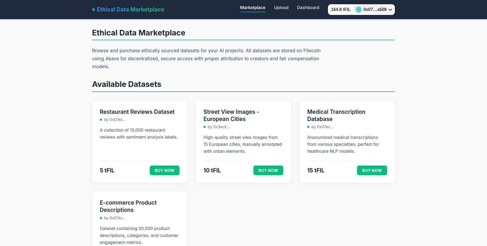

# DataEthix

## Introduction
DataEthix is a decentralized platform that enables data creators to monetize their content securely using Filecoin and Akave. AI developers can purchase high-quality datasets ethically, ensuring fair payments and proper attribution to original creators.

This platform bridges the gap between AI developers and data contributors, fostering transparency, privacy, and fairness in data sharing.

---

## Features
### **For Data Creators:**
- Upload datasets securely to Filecoin using Akave.
- Set a price for access and receive fair compensation.
- Retain credit and ownership rights over their data.

### **For AI Developers:**
- Browse and purchase high-quality datasets with cryptocurrency.
- Instantly access datasets after secure blockchain-based payment.
- Ensure compliance with ethical data sourcing standards.

### **Security & Transparency:**
- Uses smart contracts for automated payments and access control.
- Ensures immutable and verifiable ownership records.
- Decentralized storage prevents unauthorized data manipulation.

---

## How It Works
### **Step 1: Data Upload**
- Data creators upload their datasets to Filecoin via Akave.
- The platform generates a unique dataset ID and stores metadata.

### **Step 2: Dataset Listing**
- The dataset appears in the marketplace with details (title, description, price, etc.).
- AI developers can explore and filter datasets based on their needs.

### **Step 3: Purchase & Payment**
- AI developers select a dataset and pay using cryptocurrency.
- A smart contract verifies the transaction and releases the dataset access.

### **Step 4: Data Access & Monetization**
- Buyers receive a secure download link.
- The creator gets credited and receives payment (e.g., 80% revenue share).
- The platform takes a small fee for maintenance.

---

## Smart Contract Details
### **Dataset Management**
- `listDataset(bucketName, fileName, price)`: Adds a dataset to the marketplace.
- `buyDataset(datasetID)`: Purchases a dataset, sending funds to the owner.
- `getDataset(datasetID)`: Retrieves dataset metadata.
- `getPurchases(userAddress)`: Returns a list of datasets purchased by a user.

### **Earnings & Statistics**
- `getTotalSales(ownerAddress)`: Returns the total number of sales for a user.
- `getTotalEarnings(ownerAddress)`: Returns total earnings from dataset sales.

---

## Usage Instructions
### **Deployment**
1. Deploy the smart contract on Ethereum or another compatible chain.
2. Connect the contract to the frontend using Web3.
3. Integrate Filecoin via Akave for decentralized storage.

### **Uploading Datasets**
1. Navigate to the **Upload** section.
2. Select the dataset and enter details (name, price, description).
3. Submit the dataset, which gets stored on Filecoin.

### **Buying Datasets**
1. Browse available datasets.
2. Select a dataset and confirm payment using crypto.
3. Receive access to the dataset instantly after successful payment.

---

## Events
- `DatasetListed(uint256 id, string bucketName, string fileName, uint256 price, address owner)`: A dataset was listed.
- `DatasetPurchased(uint256 id, address buyer)`: A dataset was purchased.

---

## Security Considerations
- Smart contracts are designed to prevent unauthorized withdrawals.
- Payments are automated via blockchain to ensure fair transactions.
- Datasets remain immutable on decentralized storage.
- Regular audits are recommended before mainnet deployment.

---

## Tech Stack
- **Blockchain:** Ethereum/Solana (EVM-compatible chains)
- **Smart Contracts:** Solidity
- **Storage:** Filecoin (via Akave API)
- **Frontend:** React.js + Web3.js
- **Backend:** Node.js + Express

---

## Future Enhancements
- Implement reputation-based pricing.
- Add multi-chain support for wider adoption.
- Enable NFT-based data ownership.
- Introduce AI-driven dataset recommendations.

---

## License
This project is licensed under the MIT License. See the [LICENSE](LICENSE) file for more details.

---

## Support
For issues and support:
- Open an issue on [GitHub](https://github.com/Anish99594/EthicalDataMarketplace.git)
- Contact us via email at **anishgajbhare2000@gmail.com**

---

## Links
- **GitHub Repository:** [DataEthix](https://github.com/Anish99594/EthicalDataMarketplace.git)
- **Demo Video:** [Watch Here](https://youtu.be/VUrWS0noHlg)
- **Project Website:** [Visit Here](https://ethical-data-marketplace.vercel.app/)

